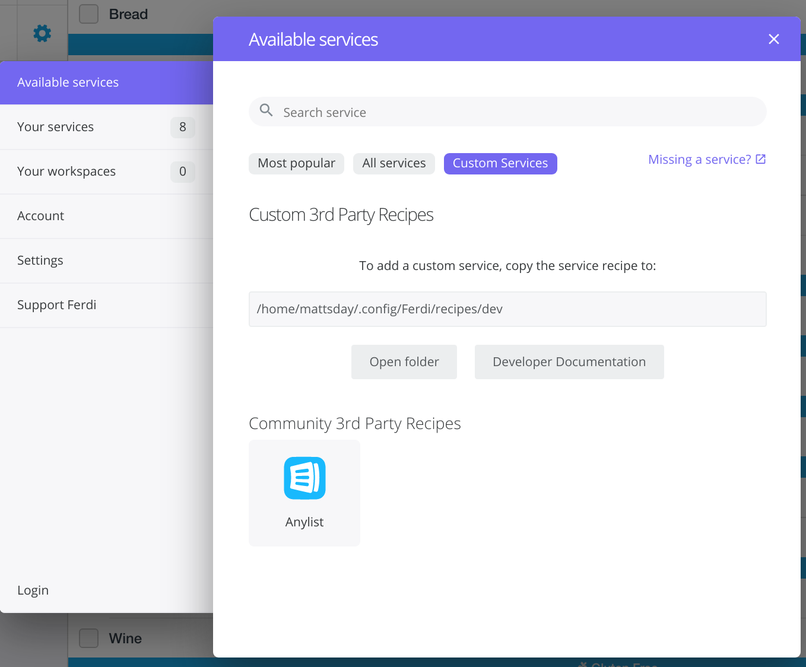

# AnyList Recipe

This is an [AnyList](https://www.anylist.com/) recipe for [Ferdi](https://github.com/getferdi/ferdi)/[Franz](https://meetfranz.com).

## Requirements

* An [AnyList Complete](https://www.anylist.com/complete) account
* Ferdi or Franz version 5 or later (not tested on the latter)

## Installation

### Automated

Run the bash script `install.sh` to attempt an automated installation (only tested on Linux but should work for Mac - Windows users need to see below).

### Manual

Note: For more information, please see the [Franz recipe documentation](https://meetfranz.com/developer/recipe/getting-started).

You will need to copy this repo to one of the following locations:

#### Ferdi Users

| OS      | Location                                                |
|---------|---------------------------------------------------------|
| Linux   | ~/.config/Ferdi/recipes/dev/anylist                     |
| Windows | %appdata%/Ferdi/recipes/dev/anylist                     |
| Mac OS  | ~/Library/Application Support/Ferdi/recipes/dev/anylist |

#### Franz Users

| OS      | Location                                                |
|---------|---------------------------------------------------------|
| Linux   | ~/.config/Franz/recipes/dev/anylist                     |
| Windows | %appdata%/Franz/recipes/dev/anylist                     |
| Mac OS  | ~/Library/Application Support/Franz/recipes/dev/anylist |

#### Files to copy

Ensure the following files are put in to the directory specified above

* icon.svg
* icon.png
* index.js
* package.json
* webview.js

## Configuring Ferdi/Franz

After copying the files, **Restart Ferdi/Franz**

Go to Settings, select **Available Services** and select **Custom Services**

From here you should see **AnyList** as an option. If you do not, ensure you restarted Ferdi/Franz and that you have installed it to the folder shown on this screen.

## License

This software is licensed under [The MIT License](http://opensource.org/licenses/MIT).
